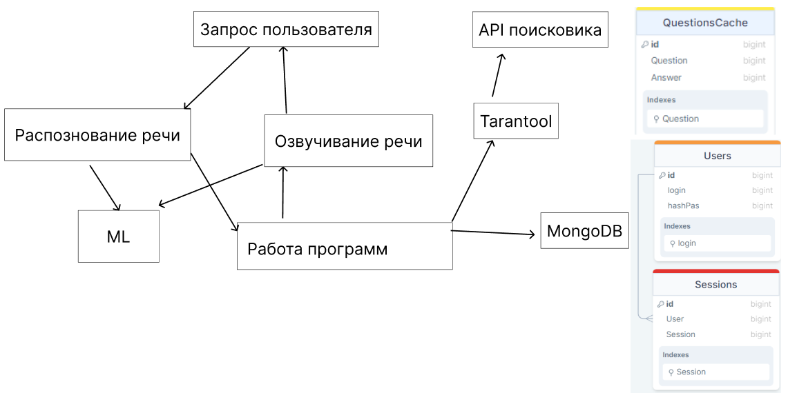

# Голосовой помощник Алиса

# Содержание

1. [Тема и целевая аудитория](#theme)  
1.1 [Основная аудитория](#auditory)  
1.2 [MVP](#mvp)  
2. [Метрики](#metrics)  
2.1 [Продуктовые метрики](#metrics-prod)  
2.2 [Технические метрики](#metrics-tech)  
3. [Глобальная балансировка](#global)  
3.1 [Расположение](#global-placement)  
3.2 [Нагрузка на дата центры](#global-load)  
3.3 [Балансировка](#global-balance)  
3.3 [Итоговое покрытие](#global-coverage)  
4 [Локальная балансировка](#local)  
5. [Список использованной литературы](#usageList)  

# 1. Тема и целевая аудитория 

***Голосовой помощник Алиса*** - это программа, которая помогает пользователям выполнять различные задачи с помощью голоса. Она может отвечать на вопросы, искать информацию в интернете, переводить тексты на разные языки и многое другое.

## 1.1 Основная аудитория 

Голосовой помощник Алиса расчитан на аудитория из России и странах СНГ. Поддерживается только русский язык. 
***MAU*** = 57 млн.[^1] 

## 1.2 MVP 

***Основными задачами голосового помощника являются[^2]:***
* Поиск информации в интернете
* Прогноз погоды
* Управление музыкой
* Запуск фильмов
* Навигация с использ   ованием голоса

***Описание функционала***
1. Возможность получить информацию из интернета на заданный вопрос.
2. Возможность узнать прогноз погоды на заданный день и город.
3. Возможность запустить в другом приложении музыкальный трек, который назван пользователем.
4. Возможность запустить в другом приложении фильм, который назван пользователем.
5. Возможность построить маршрут с использованием голоса.

# 2 Расчет нагрузки 

## 2.1 Продуктовые метрики 
### 2.1.1 Расчеты 
***MAU*** = 57 млн.

В 2019 году Яндекс раскрывал информацию о ежедневной аудитории[^5]. При месячной аудитории в 30 млн., дневная была 8 млн, то есть 26%. Из этого мы можем приблизительно подсчитать, что сейчай дневная аудитория Алисы составляет 57 * 26% ~= 15 млн. пользователей.

***DAU*** ~= 15 млн.

***Данные одного пользователя***

Алиса должна хранить диалоги с пользователем. Так как возможность общаться есть только в одном чате, то хранит она один чат. Пользователи задают в месяц 3.3 млрд. запросов в месяц, а значит один пользователь задаёт 3 300 млн. / 57 млн. = 58 запросов в месяц. 

Алиса хранит диалоги 14 дней[^14], после чего, если пользователь не запросил, удаляет их. Предположим, что Алиса отправляет аудио и принимает аудио от пользователей. Также пользователь может общаться с ней при помощи чата.

Рассчитаем количество занимаемой памяти для текстового запроса. В среднем ответ голосового помощника составляет 29 слов[^4]. Так как нет информации по средней длине запроса, то можем предположить около 10 слов. Большой процент всех запросов делается[^6] по категориям, которые содержат в запросе не больше 5 слов.

Средняя длина слова составляет 5.28 букв[^7]. Вес одного символа 2 байта. Значит один текстовое запрос весит (29 + 10) * 5.28 * 2 / 1024 = 0.4 КБ.

Средний размер хранилища одного пользователя за 14 дней равно 14 * (58 * 0.4 КБ) = 324 КБ.

### 2.1.2 Финальные результаты 

| Метрика | Статистика |
|--|--|
| MAU | 57 млн. |
| DAU | 15 млн. |
| Среднее хранилище одного пользователя | 324 КБ |

## 2.2 Технические метрики 
### 2.2.1 Расчеты 

***Хранение***

У самой Алисы хранятся только записи диалогов, поэтому размер хранения равен 324 КБ * 57 млн. = 18 468 000 000 КБ или 17 ТБ.

***RPS***
Суточный трафик равен 3 300 млн. / 30 = 110 млн. запросов в день.

Из суточного трафика найдём средний RPS за день, который равен 110 млн. / 86 400 = 1 273. Из этих данных можно предположить, что пиковый RPS будет равен 1 273 * 2 = 2 546. 

Из доклада [^12] можно узнать, что в пиковые дни, например, Новый год, люди обращаются намного чаще к Алисе. Предположим, что в эти дни пиковый RPS равен 1 273 * 3 = 3 819.

***Сетевой трафик***

В докладе[^12] говорится, что Алиса постоянно передаёт речь пользователя для её анализе на сервере, поэтому из пикового RPS рассчитаем нагрузку на сервер. Предположим, что битрейт у Алисы и у Яндекс Музыки одинаковый и равный 192 Кбит/c[^11]. Среднее время в секунд на запрос, которые нужно озвучить = (29 + 10) * (60/80) = 30 сек, как на разговор пользователя, так и на ответ Алисы. Тогда получается, что пропускная способность Алисы должна быть равной 192 Кбит/c * 3 819 RPS * 30 сек / 1024 = 21 481 Мбит/с или 21 Гбит/с.

Рассчитаем количество трафика, потребляемое для связи с пользователями за день, используя информацию с расчетов текстовых запросов. Тогда вес одного запроса будет равен 30 * 192 / 8 = 720 КБ. Тогда за день получаем 720 * 110 млн. / (1024^2^) = 75 531 ГБ.

Также стоит учитывать, что для всех тем, кроме поиска информации Алиса осуществляет перевод текста пользователя, а также распознавание его намерения. В поиске Алиса должна ещё узнать информацию для пользователя. Предположим, что такой запрос весит 0.3 КБ. Тогда, с каждым запросом на поиск, Алиса дополнительно ищет информацию на 0.3 КБ.
 
### 2.2.2 Финальные результаты 

| Метрика | Статистика |
|--|--|
| Размер хранения диалогов | 17 ТБ |
| Суммарный суточный трафик | 75 547 ГБ |
| Пиковое потребление | 21 Гбит/с |
| Количество запросов за день | 110 млн. |

***RPS***

|Тип запроса| Средний|
|--|--|
| RPS средний | 1 273 |
| Пиковый RPS | 2 546 |
| RPS в особые дни | 3 819 |

# 3. Глобальная балансировка 

## 3.1 Расположение 

Так как Алиса нацелена в первую очередь на рынок РФ, то сервера будут распологаться только в данной стране для лучшего подключения. 

Изучив плотность населения по регионам в РФ[^17], прохождение магистральных кабелей[^20], а также население федеральных округов[^21], можно выбрать следующие локации для размещения дата центров:
* Москва
* Санкт-Петербург
* Екатеринбург
* Хабаровск
* Краснодар

## 3.2 Нагрузка на дата центры 

Рассчитаем процент пользователей для Алисы от всех жителей России. В России проникновение интернета составляет 88.2%[^19]. Также процент проникновения Алисы равен 57 / (127 * 88%) * 100% = 50%, тогда коэффициент для пользователей Алисы равен 0,441 или 44%

Рассчитаем среднее количество пользователей на каждый федеральный округ России[^21].

|Федеральный округ|Пользуется Алисой человек тыс.|
|--|--| 
| ЦентЩральный      | 15 662    |
| Приволжский       | 11 164    |
| Сибирский         | 6 478     |
| Южный             | 6 477     |
| Северо-Западный   | 5 397     |
| Уральский         | 4 771     |
| Северо-Кавказский | 3 972     |
| Дальневосточный   | 3 076     |

Для быстрого ответа на запросы пользователя, а также возможности Алисы сообщать другую информацию, нам нужно поддерживать постоянное соединение. Поэтому можно учитывать количество пользователей, как количество постоянных соединение с дата центром.

| Дата центр        | Пользователи тыс. | Средний RPS за день |Пиковый RPS |
|-|-|-|-|
| Москва            | 15 662            |    350              |   1051  |
| Санкт-Петербург   | 5 397             |    120              |   362   |
| Екатеринбург      | 15 935            |    356              |   1069  |
| Хабаровск         | 9 554             |    213              |   641   |
| Краснодар         | 10 449            |    233              |   701   |

## 3.3 Балансировка 

Для распределения трафика между дата центрами будет использоваться система Latency-based DNS. Она позволит учитывать нагрузку на сеть, а также её перестроение при выдаче адреса для пользователя.

## 3.4 Итоговое покрытие 

В итоге получилось 5 местоположений для наших дата центров. На карте показано распределение нагрузки на каждый дата центр. 

Данное расположение дата центрев позволит уменьшить задержку передачи данных, что предоставить возможность обрабатывать данные дольше, без видимых для пользователя задержек.

При данном расположении дата центров задержка от пользователя будет состовлять не больше 25 мс, при учете, что 299 км дают 1мс задержки. 

# 4 Локальная балансировка 
---

# Список использованной литературы 

[^1]: [Отчёт за квартал 2023 года Яндекс](https://yastatic.net/s3/ir-docs/events/2023/IR_2Q2023_RUS.pdf)
[^2]: [Навыки Алисы](https://dialogs.yandex.ru/store/essentials.)
[^4]: [Voice Search Statistics: Smart Speakers, Voice Assistants, and Users in 2023](https://serpwatch.io/blog/voice-search-statistics/)
[^5]: ["Яндекс" назвал ежедневную аудиторию голосового помощника "Алиса"](https://www.dp.ru/a/2019/01/25/JAndeks_nazval_ezhednevnu)
[^6]: [Больше денег – больше слов: как голосовые помощники завоевывают рынок](https://rocketdata.ru/blog/voice-search-market)
[^7]: [Статистика слов в русском языке](http://lingvisto.org/artikoloj/ru_stat.html)
[^8]: [Статистика](https://www.demandsage.com/voice-search-statistics/#:~:text=More%20than%2020%25%20of%20the,are%20supported%20by%20Google%20Assistant.)
[^9]: [Голосовые помощники: что это и зачем они HR](https://hurma.work/rf/blog/voice-assistants-chto-eto-i-zachem-oni-hr-2/)
[^10]: [Большая российская энциклопедия 2004-2017](https://old.bigenc.ru/linguistics/text/4186876)
[^11]: [Yandex Support](https://yandex.ru/support/music/users/listening.html)
[^12]: [Доклад HighLoad](https://highload.ru/spb/2023/abstracts/10131)
[^13]: [Voice report 2019](https://advertiseonbing-blob.azureedge.net/blob/bingads/media/insight/whitepapers/2019/04%20apr/voice-report/bingads_2019_voicereport.pdf)
[^14]: Ответ Алисы
[^15]: [Яндекс ИТ-инфраструктура](https://www.tadviser.ru/index.php/%D0%A1%D1%82%D0%B0%D1%82%D1%8C%D1%8F:%D0%AF%D0%BD%D0%B4%D0%B5%D0%BA%D1%81_(%D0%98%D0%A2-%D0%B8%D0%BD%D1%84%D1%80%D0%B0%D1%81%D1%82%D1%80%D1%83%D0%BA%D1%82%D1%83%D1%80%D0%B0))
[^16]: [«Яндекс» начал строительство четвёртого дата-центра в России](https://habr.com/ru/news/689764/)
[^17]: [Плотность населения РФ](https://www.statdata.ru/karta/plotnost-naseleniya-rossii)
[^18]: [Округа РФ](https://secretmag.ru/enciklopediya/federalnye-okruga.htm)
[^19]: [Global Statistics Russia](https://datareportal.com/reports/digital-2023-russian-federation#:~:text=There%20were%20127.6%20million%20internet,percent%20of%20the%20total%20population.)
[^20]: [Магистральные сети связи в России](https://www.comnews.ru/content/211042/2020-10-21/2020-w43/magistralnye-seti-svyazi-rossii)
[^21]: [Население федеральных округов России](https://www.statdata.ru/naselenie-federalnyh-okrugov-rossii)

[Методические Указания](https://github.com/init/highload/blob/main/homework_architecture.md)