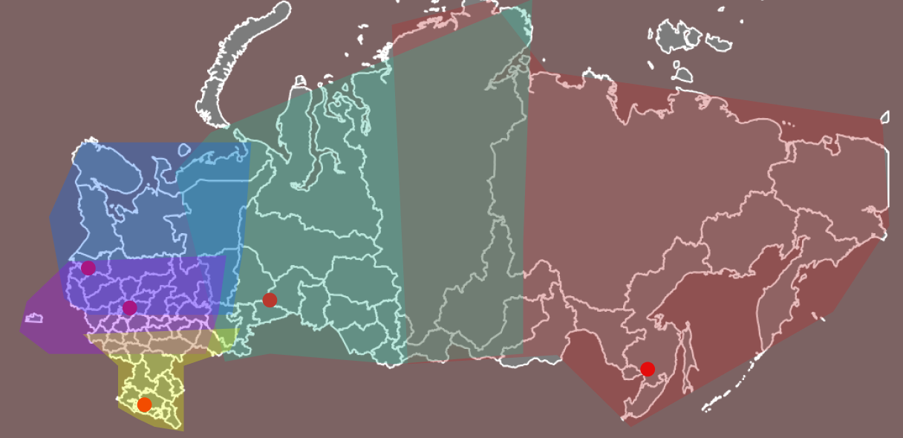
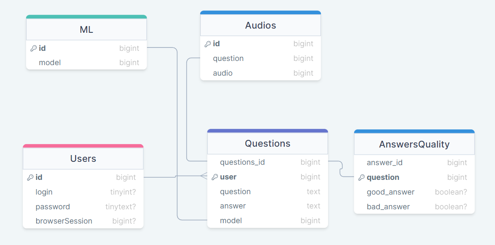
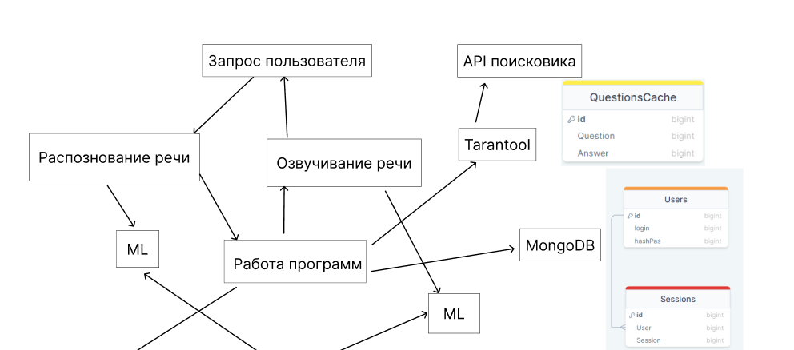
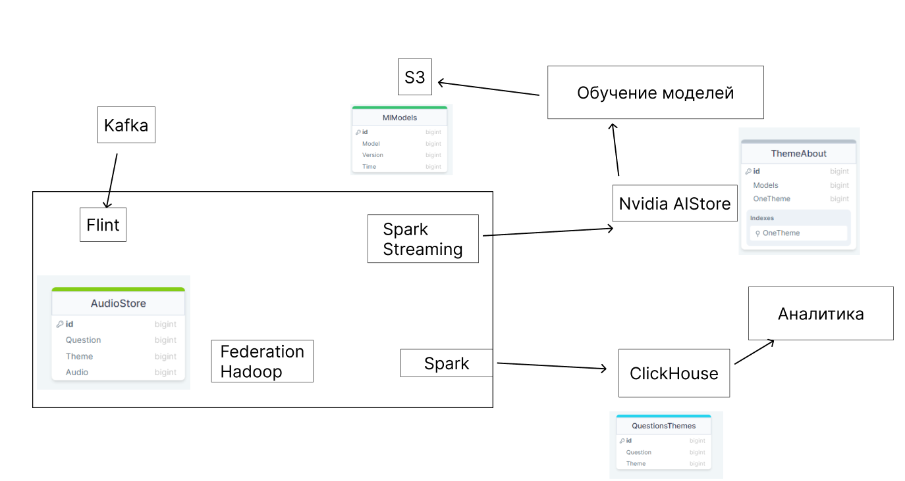
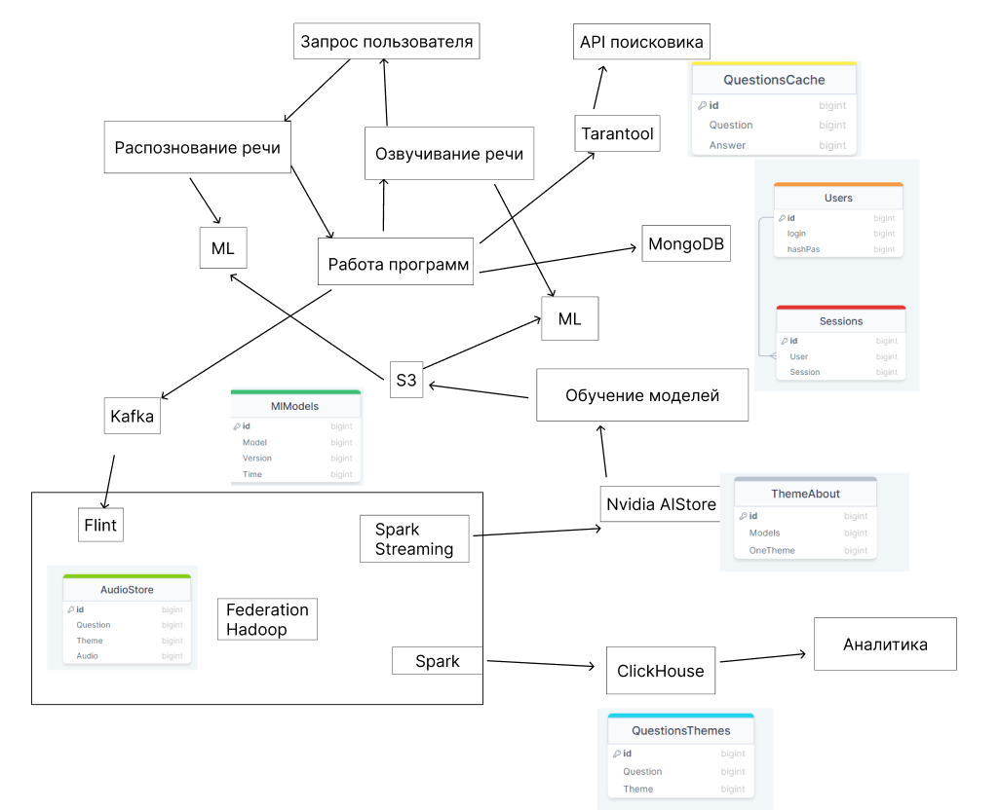
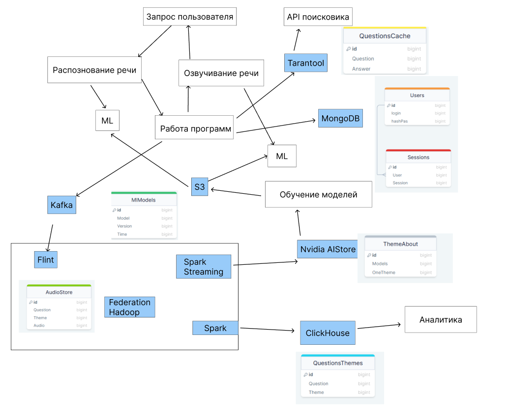
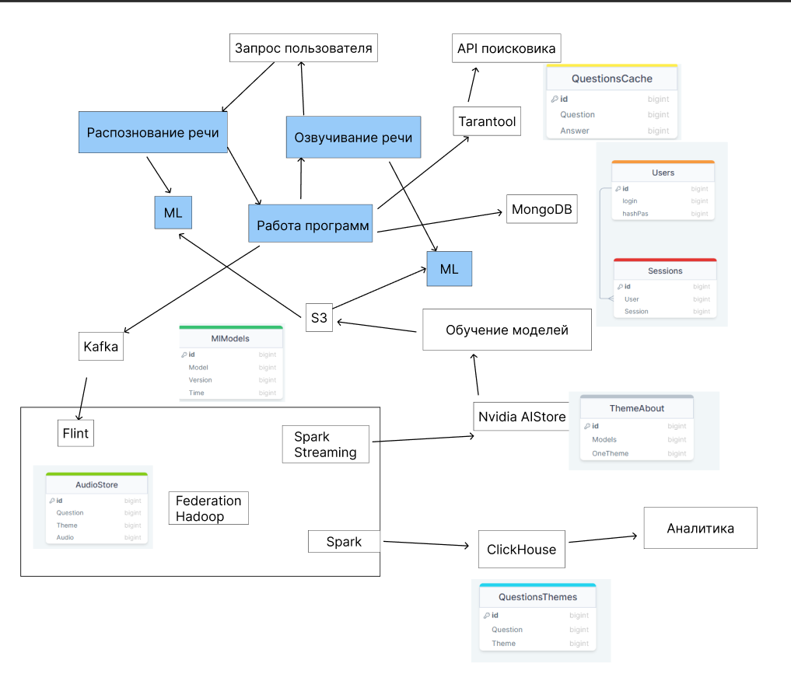
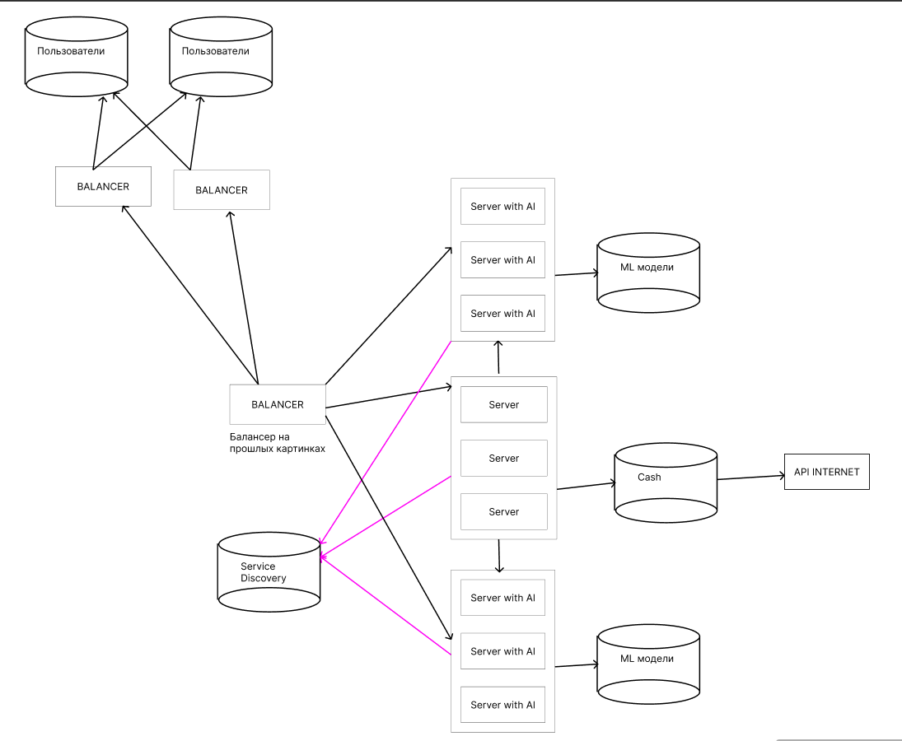

# Голосовой помощник Алиса

# Содержание

1. [Тема и целевая аудитория](#theme)  
1.1 [Основная аудитория](#auditory)  
1.2 [MVP](#mvp)  
2. [Метрики](#metrics)  
2.1 [Продуктовые метрики](#metrics-prod)  
2.2 [Технические метрики](#metrics-tech)  
3. [Глобальная балансировка](#global)  
3.1 [Расположение](#global-placement)  
3.2 [Нагрузка на дата центры](#global-load)  
3.3 [Балансировка](#global-balance)  
3.3 [Итоговое покрытие](#global-coverage)  
4. [Локальная балансировка](#local)  
4.1 [Вход в дата центр](#local-enter)  
5. [Базы данных](#bd)  
5.1 [Логическая схема](#bd-scheme)  
5.2 [Связь с API](#bd-api)  
5.3 [Размер данных](#bd-size)  
22. [Список использованной литературы](#usageList)  

# 1. Тема и целевая аудитория 

***Голосовой помощник Алиса*** - это программа, которая помогает пользователям выполнять различные задачи с помощью голоса. Она может отвечать на вопросы, искать информацию в интернете, переводить тексты на разные языки и многое другое.

## 1.1 Основная аудитория 

Голосовой помощник Алиса расчитан на аудитория из России и странах СНГ. Поддерживается только русский язык. 
***MAU*** = 57 млн.[^1] 

## 1.2 MVP 

***Основными задачами голосового помощника являются[^2]:***
* Поиск информации в интернете
* Прогноз погоды
* Управление музыкой
* Запуск фильмов
* Навигация с использованием голоса

***Описание функционала***
1. Возможность получить информацию из интернета на заданный вопрос.
2. Возможность узнать прогноз погоды на заданный день и город.
3. Возможность запустить в другом приложении музыкальный трек, который назван пользователем.
4. Возможность запустить в другом приложении фильм, который назван пользователем.
5. Возможность построить маршрут с использованием голоса.

# 2 Расчет нагрузки 

## 2.1 Продуктовые метрики 
### 2.1.1 Расчеты 
***MAU*** = 57 млн.

В 2019 году Яндекс раскрывал информацию о ежедневной аудитории[^5]. При месячной аудитории в 30 млн., дневная была 8 млн, то есть 26%. Из этого мы можем приблизительно подсчитать, что сейчай дневная аудитория Алисы составляет 57 * 26% ~= 15 млн. пользователей.

***DAU*** ~= 15 млн.

***Данные одного пользователя***

Алиса должна хранить диалоги с пользователем. Так как возможность общаться есть только в одном чате, то хранит она один чат. Пользователи задают в месяц 3.3 млрд. запросов в месяц, а значит один пользователь задаёт 3 300 млн. / 57 млн. = 58 запросов в месяц. 

Алиса хранит диалоги 14 дней[^14], после чего, если пользователь не запросил, удаляет их. Предположим, что Алиса отправляет аудио и принимает аудио от пользователей. Также пользователь может общаться с ней при помощи чата.

Рассчитаем количество занимаемой памяти для текстового запроса. В среднем ответ голосового помощника составляет 29 слов[^4]. Так как нет информации по средней длине запроса, то можем предположить около 10 слов. Большой процент всех запросов делается[^6] по категориям, которые содержат в запросе не больше 5 слов.

Средняя длина слова составляет 5.28 букв[^7]. Вес одного символа 2 байта. Значит один текстовое запрос весит (29 + 10) * 5.28 * 2 / 1024 = 0.4 КБ.

Средний размер хранилища одного пользователя за 14 дней равно 14 * (58 * 0.4 КБ) = 324 КБ.

### 2.1.2 Финальные результаты 

| Метрика | Статистика |
|--|--|
| MAU | 57 млн. |
| DAU | 15 млн. |
| Среднее хранилище одного пользователя | 324 КБ |

## 2.2 Технические метрики 
### 2.2.1 Расчеты 

***Хранение***

У самой Алисы хранятся только записи диалогов, поэтому размер хранения равен 324 КБ * 57 млн. = 18 468 000 000 КБ или 17 ТБ.

***RPS***
Суточный трафик равен 3 300 млн. / 30 = 110 млн. запросов в день.

Из суточного трафика найдём средний RPS за день, который равен 110 млн. / 86 400 = 1 273. Из этих данных можно предположить, что пиковый RPS будет равен 1 273 * 2 = 2 546. 

Из доклада [^12] можно узнать, что в пиковые дни, например, Новый год, люди обращаются намного чаще к Алисе. Предположим, что в эти дни пиковый RPS равен 1 273 * 3 = 3 819.

***Сетевой трафик***

В докладе[^12] говорится, что Алиса постоянно передаёт речь пользователя для её анализе на сервере, поэтому из пикового RPS рассчитаем нагрузку на сервер. Предположим, что битрейт у Алисы и у Яндекс Музыки одинаковый и равный 192 Кбит/c[^11]. Среднее время в секунд на запрос, которые нужно озвучить = (29 + 10) * (60/80) = 30 сек, как на разговор пользователя, так и на ответ Алисы. Тогда получается, что пропускная способность Алисы должна быть равной 192 Кбит/c * 3 819 RPS * 30 сек / 1024 = 21 481 Мбит/с или 21 Гбит/с.

Рассчитаем количество трафика, потребляемое для связи с пользователями за день, используя информацию с расчетов текстовых запросов. Тогда вес одного запроса будет равен 30 * 192 / 8 = 720 КБ. Тогда за день получаем 720 * 110 млн. / (1024^2^) = 75 531 ГБ.

Также стоит учитывать, что для всех тем, кроме поиска информации Алиса осуществляет перевод текста пользователя, а также распознавание его намерения. В поиске Алиса должна ещё узнать информацию для пользователя. Предположим, что такой запрос весит 0.3 КБ. Тогда, с каждым запросом на поиск, Алиса дополнительно ищет информацию на 0.3 КБ.
 
### 2.2.2 Финальные результаты 

| Метрика | Статистика |
|--|--|
| Размер хранения диалогов | 17 ТБ |
| Суммарный суточный трафик | 75 547 ГБ |
| Пиковое потребление | 21 Гбит/с |
| Количество запросов за день | 110 млн. |

***RPS***

|Тип запроса| Средний|
|--|--|
| RPS средний | 1 273 |
| Пиковый RPS | 2 546 |
| RPS в особые дни | 3 819 |

# 3. Глобальная балансировка 

## 3.1 Расположение 

Так как Алиса нацелена в первую очередь на рынок РФ, то сервера будут распологаться только в данной стране для лучшего подключения. 

Изучив плотность населения по регионам в РФ[^17], прохождение магистральных кабелей[^20], а также население федеральных округов[^21], можно выбрать следующие локации для размещения дата центров:
* Москва
* Санкт-Петербург
* Екатеринбург
* Хабаровск
* Краснодар

## 3.2 Нагрузка на дата центры 

Рассчитаем процент пользователей для Алисы от всех жителей России. В России проникновение интернета составляет 88.2%[^19]. Также процент проникновения Алисы равен 57 / (127 * 88%) * 100% = 50%, тогда коэффициент для пользователей Алисы равен 0,441 или 44%

Рассчитаем среднее количество пользователей на каждый федеральный округ России[^21].

|Федеральный округ|Пользуется Алисой человек тыс.|
|--|--| 
| Центральный       | 15 662    |
| Приволжский       | 11 164    |
| Сибирский         | 6 478     |
| Южный             | 6 477     |
| Северо-Западный   | 5 397     |
| Уральский         | 4 771     |
| Северо-Кавказский | 3 972     |
| Дальневосточный   | 3 076     |

Для быстрого ответа на запросы пользователя, а также возможности Алисы сообщать другую информацию, нам нужно поддерживать постоянное соединение. Поэтому можно учитывать количество пользователей, как количество постоянных соединение с дата центром.

| Дата центр        | Пользователи тыс. | Средний RPS за день |Пиковый RPS |
|-|-|-|-|
| Москва            | 15 662            |    350              |   1051  |
| Санкт-Петербург   | 5 397             |    120              |   362   |
| Екатеринбург      | 15 935            |    356              |   1069  |
| Хабаровск         | 9 554             |    213              |   641   |
| Краснодар         | 10 449            |    233              |   701   |

## 3.3 Балансировка 

Для распределения трафика между дата центрами будет использоваться система Latensy-based DNS. Будут осуществляться запросы ко всем дата центрам, а они будут обмениваться информацией и в итоге клиент будет перенаправлен на тот дата центр, к которому меньше всего задержка. 

Собственный Latensy-based DNS будет описан в следующих пунктах.

## 3.4 Итоговое покрытие 

В итоге получилось 5 местоположений для наших дата центров. На карте показано распределение нагрузки на каждый дата центр. 

Данное расположение дата центрев позволит уменьшить задержку передачи данных, что предоставить возможность обрабатывать данные дольше, без видимых для пользователя задержек.

При данном расположении дата центров задержка от пользователя будет состовлять в западной части не больше 13 мс, а в восточной не более 43, при учете, что 700 км дают 10 мс задержки. 

| Дата центр        | Максимальная Задержка мс        |
|-|-|
| Москва            | 7            |
| Санкт-Петербург   | 14             |
| Екатеринбург      | 28            |
| Хабаровск         | 35             |
| Краснодар         | 14            |

# 4. Локальная балансировка 

## 4.1 Вход в дата центр 

DNS отдаёт адрес "Big Balancer", поэтому весь входящий трафик сначала попадает на "Big Balancer". "Big Balancer" определеяет минимально загруженный балансировщик по принципу минмальных подключений к балансировщику. Перенаправление будет выполнино при помощи 302 редирект.

После чего он перенаправляет пользователя на данный балансировщик. Так как в Алисе поддерживается постоянное соединение, то мы можем пожертвовать временем на более долгое первичное подключение, но быструю работу потом.

При падении балансировщика все клиенты должны подключаться с разной задержкой, что будет осуществлено на клиентской стороне. Нагрузка при выходе из строя 10% балансировщиков. 

На клиенте будет реализован алгоритм, который будет рандомно выбирать значение от 0 до 5, после чего ждать выбранное количество секунд и пытаться переподключиться. Если не получилось, то делать новый запрос через интервал, до 10 секунд. 

Из-за данного алгоритма, можно разделить всю нагрузку с упавших балансировщиков равномерно по времени, поэтому нагрузка будет рассчитана по формуле (трафик с упавших балансировщиков) / 6.

| Дата центр | Big Balancer   нагрузка в тыс | Количество Big Balancer |
|-|-|-|
| Москва            | 261   |     26  |
| Санкт-Петербург   | 89    |      8  |
| Екатеринбург      | 265   |     26  |
| Хабаровск         | 159   |     15  |
| Краснодар         | 174   |     17  |

Для балансировки "Big Balancer" использована технология BGP Anycast. Большие балансировщики подключены к базе "Live BD", которая раз в секунду опрашивает балансеры о нагрузке и записывает в себя.

При максимальном количестве переподключений большой балансер должен обладать из 24 ядер минимум[^28].

Каждый балансировщик имеет подключения от 2 свитчей, что увеличит отказоустойчивость системы. Также большой балансировщик является важной частью балансировки внутри дата центра, поэтому он попарно резервируется при помощи VRRP.

***Схема устройства входа в дата центр***

***Схема подключения к балансировщику и получения ответа от сервера***

## 4.2 Балансировка до сервера  

После того, как трафик попадает в дата центр, будет организована балансировка при помощи L7 балансировщика. Плюсом данного типа балансировки является то, что у нас будет возможность просматривать конкретные протоколы, а также ставить timeout и следить за падениями определенных серверов. Также, он будет поддерживать persistent connection с серверами, что уберёт задержку при отправке запросов.

Для связи серверов внутри дата центра будет использоваться Server Mesh c Proxy, установленным на каждый сервер. Так как приложения будту запущены в контейнерах, то также будет использоваться eBPF[^24][^26][^27] для связи приложений друг с другом, если они находятся на одном сервере.

На роль L7 балансировщика, а также Proxy будет выбран Envoy[^22][^23], так как он быстрее работает с HTTPS, может обработать больше запросов, а также поддерживает динамическое изменение конфигурации по gRPC запросам. 

Один Envoy(nginx) сервер может выдержать 100 000 соединений[^25]. Количество серверов на каждый регион:

| Дата центр        | Серверы        |
|-|-|
| Москва            | 156            |
| Санкт-Петербург   | 53             |
| Екатеринбург      | 159            |
| Хабаровск         | 95             |
| Краснодар         | 104            |

***Схема устройства внутри.***

# 5. Базы данных 

## 5.1 Логическая схема 

Алиса хранит диалоги в базе данных в таблице Questions. Пользователем может быть либо устройство с browserSession, который выдаётся, либо с аккаунтом, где есть login и password. 

Для оценки работы алгоритма, оценки пользователей по качеству ответа будут вноситься в AnswersQuality.

В таблице ML находятся все модели, которые были разработаны и применены за время работы Алисы. В Audios хранятся все записи диалогов, чтобы можно было обучать модели дальше.

При допуске, что ML модели релизятся раз в неделю, а также, что нам нужно развернуть модель на X серверов, можно сказать, что нагрузка на чтение будет равна X запросов в неделю, так как процесс деплоя будет проходить постепенно. Запись один раз в неделю.

Так как Audios служит для обучения модели, где будут запрашиваться определенные куски данных.  Для рассчета RPS нужно предположить, что есть M моделей, которые постоянно обучаются, тогда RPS будет равен M.

По статистике, только около 5-10% клиентов оставляют отзыв[^32]. Исходя из этого можно рассчитать количество запросов на запись в AnswersQuality таблицу. Чтение данных будет происходить при обучении моделей.

Для рассчета количества записей возьмем два финансовых отчета яндекса и найдём количество новых пользователей. За октябрь[^33] 61.5 млн, а за июль [^1] 57. Получим RPS на запись в таблицу равный (61.5 млн - 57 млн) / (4 * 30 * 24 * 60 * 60) = 0.5 RPS

| Таблица | Нагрузка   чтение | Нагрузка   запись |
|-|-|-|
| ML             | X в неделю   | 1 раз в неделю       |
| Audios         | 3 819        | M                    |
| Users          | 3 819        | 0.5 RPS              |
| Questions      | 3 819        | M                    |
| AnswersQuality | 381          | M                    |

## 5.2 Связь с API 

Каждый запрос к Алиcе должен быть записан в БД, при этом, также должен быть записан и ответ. Можно предположить, что при больших нагрузках, можно позволить отставания в записи, так как ответ должен будет отправиться пользователю и быть прослушан им.

Также, сделаем шардирование, которое поможет уменьшить нагрузку на определенную часть БД. Также будем использовать хранение в каждом дата центре данных о пользователе, и несколько раз за сутки синхронизировать эти данные.

## 5.3 Размер данных 

Размер индексов рассчитаем из того, что пользователь в среднем делает 58 запросов в месяц, а храним только 14 дней, и того получаем (58 / 2) * 8 байт = 232 байта на пользователя или 57 млн * 232 = 12 ГБ. 

Пусть логин будет состоять максимум из 32 знаков. Для хранения индексов о логине или сессии будет использовано 57 000 000 * (32 * 16) = 27 ГБ.

В пункте 2.1 получаем, что средний запрос к Алисе составляет 7.5 секунд. Алисы составляет 192 Кбит/с. Тогда средняя запись голоса весит 180КБ. Тогда за 1 месяц получаем 9 ТБ данных. Предположим, что записи голоса хранятся два года. Тогда хранение голоса занимает 9 * 12 * 3 = 324 ТБ. 

| Данные | Размер |
|--|--|
| Хранение вопросов в текстовом виде | 17 ТБ |
| Индексы | 39 ГБ |
| Голосовые записи | 324 ТБ |

# 6. Физическая схема баз данных 

## 6.1 Ответ на запросы 

### Index

Tarantool:
* Index на вопрос, чтобы быстрее осуществлялся поиск по конкретному вопросу

MongoDB:
* Index на Сессию, для быстроты поиска при попытке входа
* Index на Login, для быстроты поиска пользователя при авторизации

### Табличка

Субд| Функционал | Производительность| Надежность| Масштабирование| Резервирование | Нагрузка |
|-|-|-|-|-|-|-|
| Tarantool | Выступает кешом перед походами в поисковик. Отвечает на самые популярные запросы сразу. | In-memory | Будет использоваться репликация и шардирование на самые популярные топики, чтобы ускорить работу на чтение | Смотреть надежность | В данном случае ненужно, так как при падении данные будут записаны с запросов пользователей | 3 819 RPS на чтение, если пустой то и на запись |
| MongoDB | Хранит данные о пользователях и их сессиях | Поддерживает индексы | Можно создать по реплике данных на каждом ДЦ. Также использовать Master-Slave в каждом ДЦ | Поддерживает шардирование. | Создаются бэкапы[^29] | 3 819 на чтение, 0.5 на запись |

## 6.2 Работа с Hadoop

### Табличка

Субд  |Функционал | Производительность| Надежность| Масштабирование|Резервирование | Нагрузка |
|-|-|-|-|-|-|-|
| Hadoop | Хранение голосовых сообщений пользователя |  | Federation создаёт реплику каждых данных | Горизонтальное маштабирование путём добавления namespace | Federation создаёт реплику для обеспечение отказоустойчивости | Запись 1 запрос раз в 5 минут. Чтение: 2 запроса в 12 часлов, для загрузки данных в ClickHouse и Nvidia AIStore |
| ClickHouse | Загрузка данных для аналитиков | Не более 100 RPS[^30] | Позволяет создавать реплику только таблиц, не целиком БД | Поддерживает шардирование | Создается Backup раз в день автоматически. Можно создавать вручную | Запись раз в 12 часов. Чтение 2 раза за час(1) |
| Kafka | Хранит временные данные для записи раз в 5 минут в Hadoop | Высокая производительность. Kafka будет получать от сервера записи голоса полностью вместе с расшифровкой[^31] | Поддерживает создание реплик | Горизонтальное маштабирование: создание нескольких брокеров | Можно создать Backup | Нагрузка на запись: 3 819. Чтение раз в 5 минут |

(1) - Предположение, что аналитики читают отчеты 2 раза за час.

AIStore это object database, и в ней будут храниться подборки голосовых записей для обучения моделей.

Также ML модели хранятся в S3, где все параметры зависят от поставщика S3 хранилища. AIStore используется для хранения данных голосовых по различным топикам

Flint используется в данном случае не как БД, а как способ записать данные в Hadoop ровно один раз, так как имеется возможность проверки записи данных.

***Общая схема***

## 6.3 Финальная таблица

В скобках указаны физические таблицы.

Субд | Таблица из логической схемы |Функционал | Производительность| Надежность| Масштабирование| Резервирование | Нагрузка |
|-|-|-|-|-|-|-|-|
| Hadoop | Audios(AudioStore) | Хранение голосовых сообщений пользователя |  | Federation создаёт реплику каждых данных | Горизонтальное маштабирование путём добавления namespace | Federation создаёт реплику для обеспечение отказоустойчивости | Запись 1 запрос раз в 5 минут. Чтение: 2 запроса в 12 часлов, для загрузки данных в ClickHouse и Nvidia AIStore |
| ClickHouse | AnswerQuality И отдельно темы запросов(QuestionsTheme) | Загрузка данных для аналитиков | Ограничивать доступ по объёму запроса и количеству запросов в день | Позволяет создавать реплику только таблиц, не целиком БД | Поддерживает шардирование | Создается Backup раз в день автоматически. Можно создавать вручную | Запись раз в 12 часов. Чтение 2 раза за час(1) |
| Kafka | Audios(AudioStore) | Хранит временные данные для записи раз в 5 минут в Hadoop | Высокая производительность. Kafka будет получать от сервера записи голоса полностью вместе с расшифровкой[^31] | Поддерживает создание реплик | Горизонтальное маштабирование: создание нескольких брокеров | Можно создать Backup | Нагрузка на запись: 3 819. Чтение раз в 5 минут |
| Tarantool | Questions, два поля, вопрос и ответ из таблицы для работы кэша(QuestionsCache) | Выступает кешом перед походами в поисковик. Отвечает на самые популярные запросы сразу. | In-memory | Будет использоваться репликация и шардирование на самые популярные топики, чтобы ускорить работу на чтение | Смотреть надежность | В данном случае ненужно, так как при падении данные будут записаны с запросов пользователей | 3 819 RPS на чтение, если пустой то и на запись |
| MongoDB | Users(Users, Sessions) | Хранит данные о пользователях и их сессиях | Поддерживает индексы | Можно создать по реплике данных на каждом ДЦ. Также использовать Master-Slave в каждом ДЦ | Поддерживает шардирование. | Создаются бэкапы[^29] | 3 819 на чтение, 0.5 на запись |

# 7. Софт

## 7.1 Latency-based DNS

Latency-based DNS будет работать по следующему принципу:
1. Пользователь отправляет запросы во все ДЦ
2. Пользователь подключается к конкретному ДЦ, который был выдан DNS
3. ДЦ обмениваются информацией о задержках от пользователя
4. ДЦ, где сейчас подключен пользователь перенаправляет его на ДЦ с минимальной задержкой

# 8.1 Технологии

| Технология  | Применение  | Обоснование|
|-------------|--------------------------------|-|
| Go          | Backend, основной язык сервисов| Простота языка, удобные тулзы из коробки, высокая утилизация CPU|
| C          | Backend, высоконагруженные сервисы| Оптимизация узких мест, ускорение высоконагруженных частей проекта|
| Python          | Работа с ML, обучение моделей | Единый язык для ML задач |
| TypeScript, React | Frontend| Типизация, сокращение человеко-часов не отладку, ускорение процесса разработки, компонентный подход|
| ELK[^38][^39]     | Автоматизация работы с логами. Хранение и поиск данных, обработка и фильтрация, интерфейс для администрирования | Масштабируемость, отказоустойчивость, гибкость поиска, REST API, универсальность|
| Jaeger[^35]      | Система трассировки| - |                                   |
| VictoriaMetrics  | Хранение метрик и работа с метриками| Производительность, меньший объем для хранения, чем в Prometheus [^36] |
| Grafana[^37]     | Визуализация графиков, мониторинг и алерты| - |
| GitHub      | Система контроля версий, командная разработка, CI/CD.| - |
| Kubernetes  | Deploy| Масштабирование, отказоустойчивость, утилизация ресурсов|
| MPEG-DASH [^34] | Передача и разбиение аудио | Может разбивать и отправлять сразу по маленьким сегментам.  Открытый протокол, из-за чего нет стандартов.  |

# 8.2 Общая таблица

---

# Список использованной литературы 

[^1]: [Отчёт за квартал 2023 года Яндекс](https://yastatic.net/s3/ir-docs/events/2023/IR_2Q2023_RUS.pdf)
[^2]: [Навыки Алисы](https://dialogs.yandex.ru/store/essentials.)
[^4]: [Voice Search Statistics: Smart Speakers, Voice Assistants, and Users in 2023](https://serpwatch.io/blog/voice-search-statistics/)
[^5]: ["Яндекс" назвал ежедневную аудиторию голосового помощника "Алиса"](https://www.dp.ru/a/2019/01/25/JAndeks_nazval_ezhednevnu)
[^6]: [Больше денег – больше слов: как голосовые помощники завоевывают рынок](https://rocketdata.ru/blog/voice-search-market)
[^7]: [Статистика слов в русском языке](http://lingvisto.org/artikoloj/ru_stat.html)
[^8]: [Статистика](https://www.demandsage.com/voice-search-statistics/#:~:text=More%20than%2020%25%20of%20the,are%20supported%20by%20Google%20Assistant.)
[^9]: [Голосовые помощники: что это и зачем они HR](https://hurma.work/rf/blog/voice-assistants-chto-eto-i-zachem-oni-hr-2/)
[^10]: [Большая российская энциклопедия 2004-2017](https://old.bigenc.ru/linguistics/text/4186876)
[^11]: [Yandex Support](https://yandex.ru/support/music/users/listening.html)
[^12]: [Доклад HighLoad](https://highload.ru/spb/2023/abstracts/10131)
[^13]: [Voice report 2019](https://advertiseonbing-blob.azureedge.net/blob/bingads/media/insight/whitepapers/2019/04%20apr/voice-report/bingads_2019_voicereport.pdf)
[^14]: Ответ Алисы
[^15]: [Яндекс ИТ-инфраструктура](https://www.tadviser.ru/index.php/%D0%A1%D1%82%D0%B0%D1%82%D1%8C%D1%8F:%D0%AF%D0%BD%D0%B4%D0%B5%D0%BA%D1%81_(%D0%98%D0%A2-%D0%B8%D0%BD%D1%84%D1%80%D0%B0%D1%81%D1%82%D1%80%D1%83%D0%BA%D1%82%D1%83%D1%80%D0%B0))
[^16]: [«Яндекс» начал строительство четвёртого дата-центра в России](https://habr.com/ru/news/689764/)
[^17]: [Плотность населения РФ](https://www.statdata.ru/karta/plotnost-naseleniya-rossii)
[^18]: [Округа РФ](https://secretmag.ru/enciklopediya/federalnye-okruga.htm)
[^19]: [Global Statistics Russia](https://datareportal.com/reports/digital-2023-russian-federation#:~:text=There%20were%20127.6%20million%20internet,percent%20of%20the%20total%20population.)
[^20]: [Магистральные сети связи в России](https://www.comnews.ru/content/211042/2020-10-21/2020-w43/magistralnye-seti-svyazi-rossii)
[^21]: [Население федеральных округов России](https://www.statdata.ru/naselenie-federalnyh-okrugov-rossii)
[^22]: [Kubernetes Gateway Selection: Nginx or Envoy?](https://www.alibabacloud.com/blog/kubernetes-gateway-selection-nginx-or-envoy_599485)
[^23]: [Benchmarking Envoy Proxy, HAProxy, and NGINX Performance on Kubernetes](https://www.getambassador.io/blog/envoy-proxy-performance-on-k8s)
[^24]: [Hello eBPF! Goodbye Sidecars?](https://youtu.be/ThtRT8dhu8c?si=IjBqgWPV1Q03MwoE&t=676)
[^25]: [What is keepalive in Nginx](https://linuxhint.com/what-is-keepalive-in-nginx/)
[^26]: [eBPF в production-условиях / Дмитрий Евдокимов, Александр Трухин (Luntry)](https://www.youtube.com/watch?v=4PNRokR22Jw&ab_channel=HighLoadChannel)
[^27]: [How eBPF will solve Service Mesh – Goodbye Sidecars](https://isovalent.com/blog/post/2021-12-08-ebpf-servicemesh/)
[^28]: [Testing the Performance of NGINX and NGINX Plus Web Servers](https://www.nginx.com/blog/testing-the-performance-of-nginx-and-nginx-plus-web-servers/)
[^29]: [Mongo Backup](https://www.mongodb.com/docs/manual/core/backups/#std-label-backup-with-mms)
[^30]: [Clickhouse perfomance](https://clickhouse.com/docs/ru/introduction/performance)
[^31]: [Kafka perfomance](https://engineering.linkedin.com/kafka/benchmarking-apache-kafka-2-million-writes-second-three-cheap-machines)
[^32]: [Online Review Statistics: The Definitive List (2023 Data) ](https://www.luisazhou.com/blog/online-review-statistics/#:~:text=(USA%20Today)-,What%20percentage%20of%20customers%20write%20reviews%3F,go%20on%20to%20write%20them.)
[^33]: [Яндекс. Презентация о компании Октябрь 2023](https://yastatic.net/s3/ir-docs/events/2023/IR_2Q2023_RUS.pdf)
[^34]: [HLS Vs. DASH](https://imagekit.io/blog/hls-vs-dash/)
[^35]: [Просто о сложном: трассировки в микросервисах](https://habr.com/ru/companies/simbirsoft/articles/740152/)
[^36]: [Бенчмарк Prometheus vs VictoriaMetrics на метриках node_exporter](https://habr.com/ru/companies/otus/articles/541640/)
[^37]: [Monitoring as Code на базе VictoriaMetrics и Grafana](https://habr.com/ru/articles/568090/)
[^38]: [Graylog vs ELK](https://www.educba.com/graylog-vs-elk/)
[^39]: [Advantages of Graylog+Grafana Compared to ELK Stack](https://medium.com/@logicify/advantages-of-graylog-grafana-compared-to-elk-stack-a7c86d58bc2c)

[Методические Указания](https://github.com/init/highload/blob/main/homework_architecture.md)