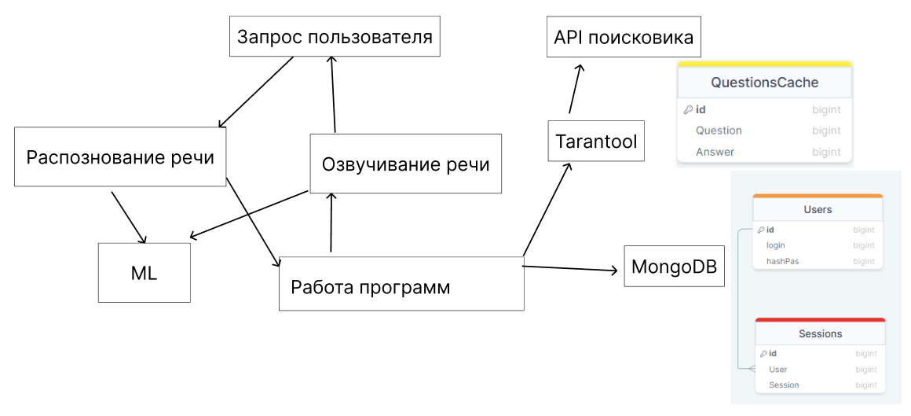

# Голосовой помощник Алиса

# Содержание

1. [Тема и целевая аудитория](#theme)
1.1 [Основная аудитория](#auditory)
1.2 [MVP](#mvp)
2. [Метрики](#metrics)
2.1 [Продуктовые метрики](#metrics-prod)
2.2 [Технические метрики](#metrics-tech)
3. [Глобальная балансировка](#global)
3.1 [Расположение](#global-placement)
3.2 [Балансировка](#global-balance)
3.3 [Итоговое покрытие](#global-coverage)
4. [Список использованной литературы](#usageList)

# 1. Тема и целевая аудитория 

***Голосовой помощник Алиса*** - это программа, которая помогает пользователям выполнять различные задачи с помощью голоса. Она может отвечать на вопросы, искать информацию в интернете, переводить тексты на разные языки и многое другое.

## 1.1 Основная аудитория 

Голосовой помощник Алиса расчитан на аудитория из России и странах СНГ. Поддерживается только русский язык. 
***MAU*** = 57 млн.[^1] 

## 1.2 MVP 

***Основными задачами голосового помощника являются[^2]:***
* Поиск информации в интернете
* Прогноз погоды
* Управление музыкой
* Запуск фильмов
* Навигация с использованием голоса

***Описание функционала***
1. Возможность получить информацию из интернета на заданный вопрос.
2. Возможность узнать прогноз погоды на заданный день и город.
3. Возможность запустить в другом приложении музыкальный трек, который назван пользователем.
4. Возможность запустить в другом приложении фильм, который назван пользователем.
5. Возможность построить маршрут с использованием голоса.

# 2 Расчет нагрузки 

## 2.1 Продуктовые метрики 
### 2.1.1 Расчеты 
***MAU*** = 57 млн.

В 2019 году Яндекс раскрывал информацию о ежедневной аудитории[^5]. При месячной аудитории в 30 млн., дневная была 8 млн, то есть 26%. Из этого мы можем приблизительно подсчитать, что сейчай дневная аудитория Алисы составляет 57 * 26% ~= 15 млн. пользователей.

***DAU*** ~= 15 млн.

***Данные одного пользователя***

Алиса должна хранить диалоги с пользователем. Так как возможность общаться есть только в одном чате, то хранит она один чат. Пользователи задают в месяц 3.3 млрд. запросов в месяц, а значит один пользователь задаёт 3 300 млн. / 57 млн. = 58 запросов в месяц. 

Алиса хранит диалоги 14 дней[^14], после чего, если пользователь не запросил, удаляет их. Предположим, что Алиса отправляет аудио и принимает аудио от пользователей. Также пользователь может общаться с ней при помощи чата.

Рассчитаем количество занимаемой памяти для текстового запроса. В среднем ответ голосового помощника составляет 29 слов[^4]. Так как нет информации по средней длине запроса, то можем предположить около 10 слов. Большой процент всех запросов делается[^6] по категориям, которые содержат в запросе не больше 5 слов.

Средняя длина слова составляет 5.28 букв[^7]. Вес одного символа 2 байта. Значит один текстовое запрос весит (29 + 10) * 5.28 * 2 / 1024 = 0.4 КБ.

Средний размер хранилища одного пользователя за 14 дней равно 14 * (58 * 0.4 КБ) = 324 КБ.

### 2.1.2 Финальные результаты 

| Метрика | Статистика |
|--|--|
| MAU | 57 млн. |
| DAU | 15 млн. |
| Среднее хранилище одного пользователя | 324 КБ |

## 2.2 Технические метрики 
### 2.2.1 Расчеты 

***Хранение***

У самой Алисы хранятся только записи диалогов, поэтому размер хранения равен 324 КБ * 57 млн. = 18 468 000 000 КБ или 17 ТБ.

***RPS***
Суточный трафик равен 3 300 млн. / 30 = 110 млн. запросов в день.

Из суточного трафика найдём средний RPS за день, который равен 110 млн. / 86 400 = 1 273. Из этих данных можно предположить, что пиковый RPS будет равен 1 273 * 2 = 2 546. 

Из доклада [^12] можно узнать, что в пиковые дни, например, Новый год, люди обращаются намного чаще к Алисе. Предположим, что в эти дни пиковый RPS равен 1 273 * 3 = 3 819.

***Сетевой трафик***

В докладе[^12] говорится, что Алиса постоянно передаёт речь пользователя для её анализе на сервере, поэтому из пикового RPS рассчитаем нагрузку на сервер. Предположим, что битрейт у Алисы и у Яндекс Музыки одинаковый и равный 192 Кбит/c[^11]. Среднее время в секунд на запрос, которые нужно озвучить = (29 + 10) * (60/80) = 30 сек, как на разговор пользователя, так и на ответ Алисы. Тогда получается, что пропускная способность Алисы должна быть равной 192 Кбит/c * 3 819 RPS * 30 сек / 1024 = 21 481 Мбит/с или 21 Гбит/с.

Рассчитаем количество трафика, потребляемое для связи с пользователями за день, используя информацию с расчетов текстовых запросов. Тогда вес одного запроса будет равен 30 * 192 / 8 = 720 КБ. Тогда за день получаем 720 * 110 млн. / (1024^2^) = 75 531 ГБ.

Также стоит учитывать, что для всех тем, кроме поиска информации Алиса осуществляет перевод текста пользователя, а также распознавание его намерения. В поиске Алиса должна ещё узнать информацию для пользователя. Предположим, что такой запрос весит 0.3 КБ. Тогда, с каждым запросом на поиск, Алиса дополнительно ищет информацию на 0.3 КБ.
 
### 2.2.2 Финальные результаты 

| Метрика | Статистика |
|--|--|
| Размер хранения диалогов | 17 ТБ |
| Суммарный суточный трафик | 75 547 ГБ |
| Пиковое потребление | 21 Гбит/с |
| Количество запросов за день | 110 млн. |

***RPS***

|Тип запроса| Средний|
|--|--|
| RPS средний | 1 273 |
| Пиковый RPS | 2 546 |
| RPS в особые дни | 3 819 |

# 3. Глобальная балансировка 

## 3.1 Расположение 

Так как Алиса нацелена в первую очередь на рынок РФ, то сервера будут распологаться только в данной стране для лучшего подключения. 

Рассмотрим плотность людей по регионам в РФ[^17]. Из данной статистики можно сказать, что целесобразно будет размещать сервера в Центральной части России, Южной части, Уральской части на юге, Приволжской части, а также в Дальневостойчной на юге[^18].

Из статистики плотности населения сервера нужно дополнительно разместить в Москве и Санкт-Петербурге, так как там проживают значительная часть населения.

## 3.2 Балансировка 

Балансировка между различными частями России будет осуществляться по принципу DNS. Внутри этих частей балансировка осуществляется по принципу BGP Anycast. Совмещенно данные технологии помогут распределять нагрузку на ближайшие к пользователю сервера. 

## 3.3 Итоговое покрытие 

В итоге получилось 8 серверов для доступа к нашим сервисам. На карте показано распределение нагрузки на каждый дата центр.

---

# Список использованной литературы 

[^1]: [Отчёт за квартал 2023 года Яндекс](https://yastatic.net/s3/ir-docs/events/2023/IR_2Q2023_RUS.pdf)
[^2]: [Навыки Алисы](https://dialogs.yandex.ru/store/essentials.)
[^4]: [Voice Search Statistics: Smart Speakers, Voice Assistants, and Users in 2023](https://serpwatch.io/blog/voice-search-statistics/)
[^5]: ["Яндекс" назвал ежедневную аудиторию голосового помощника "Алиса"](https://www.dp.ru/a/2019/01/25/JAndeks_nazval_ezhednevnu)
[^6]: [Больше денег – больше слов: как голосовые помощники завоевывают рынок](https://rocketdata.ru/blog/voice-search-market)
[^7]: [Статистика слов в русском языке](http://lingvisto.org/artikoloj/ru_stat.html)
[^8]: [Статистика](https://www.demandsage.com/voice-search-statistics/#:~:text=More%20than%2020%25%20of%20the,are%20supported%20by%20Google%20Assistant.)
[^9]: [Голосовые помощники: что это и зачем они HR](https://hurma.work/rf/blog/voice-assistants-chto-eto-i-zachem-oni-hr-2/)
[^10]: [Большая российская энциклопедия 2004-2017](https://old.bigenc.ru/linguistics/text/4186876)
[^11]: [Yandex Support](https://yandex.ru/support/music/users/listening.html)
[^12]: [Доклад HighLoad](https://highload.ru/spb/2023/abstracts/10131)
[^13]: [Voice report 2019](https://advertiseonbing-blob.azureedge.net/blob/bingads/media/insight/whitepapers/2019/04%20apr/voice-report/bingads_2019_voicereport.pdf)
[^14]: Ответ Алисы
[^15]: [Яндекс ИТ-инфраструктура](https://www.tadviser.ru/index.php/%D0%A1%D1%82%D0%B0%D1%82%D1%8C%D1%8F:%D0%AF%D0%BD%D0%B4%D0%B5%D0%BA%D1%81_(%D0%98%D0%A2-%D0%B8%D0%BD%D1%84%D1%80%D0%B0%D1%81%D1%82%D1%80%D1%83%D0%BA%D1%82%D1%83%D1%80%D0%B0))
[^16]: [«Яндекс» начал строительство четвёртого дата-центра в России](https://habr.com/ru/news/689764/)
[^17]: [Плотность населения РФ](https://www.statdata.ru/karta/plotnost-naseleniya-rossii)
[^18]: [Округа РФ](https://secretmag.ru/enciklopediya/federalnye-okruga.htm)

[Методические Указания](https://github.com/init/highload/blob/main/homework_architecture.md)